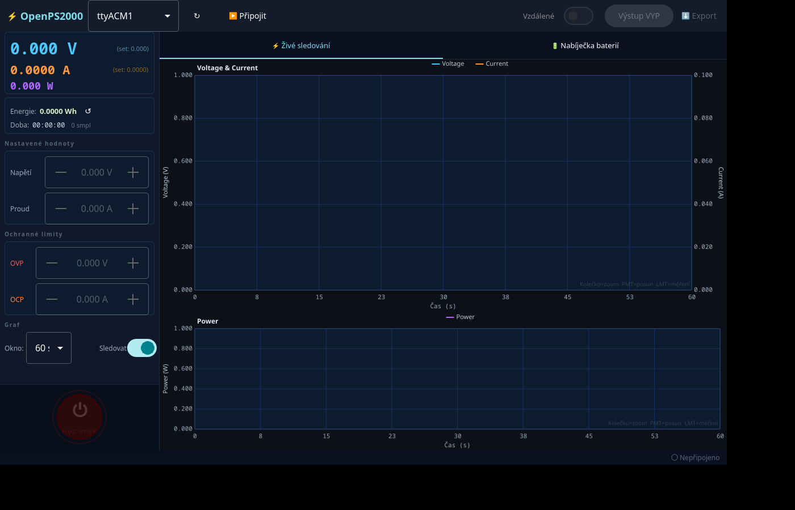
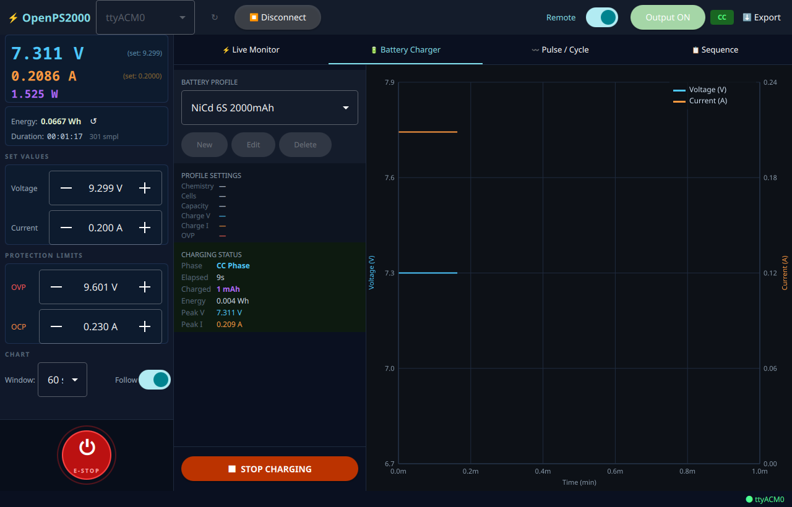
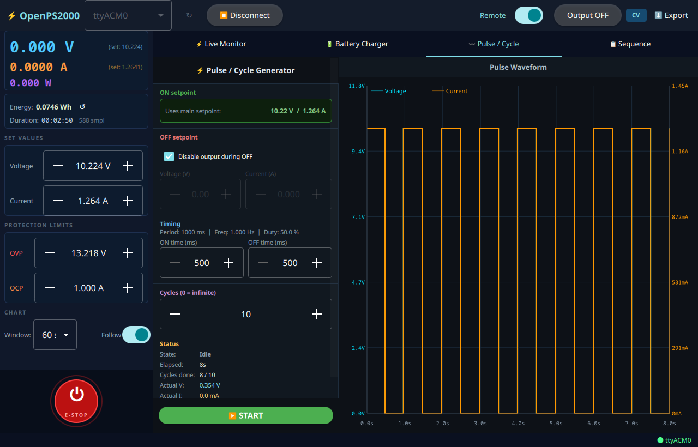
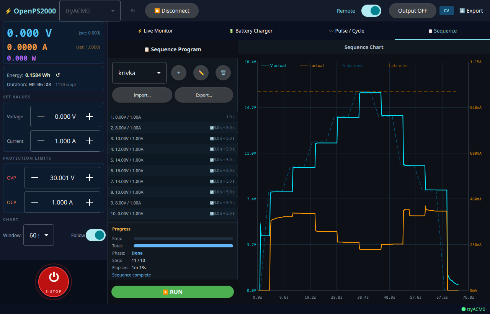
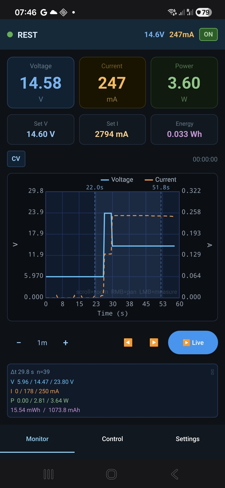
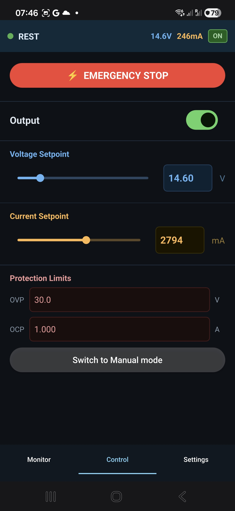
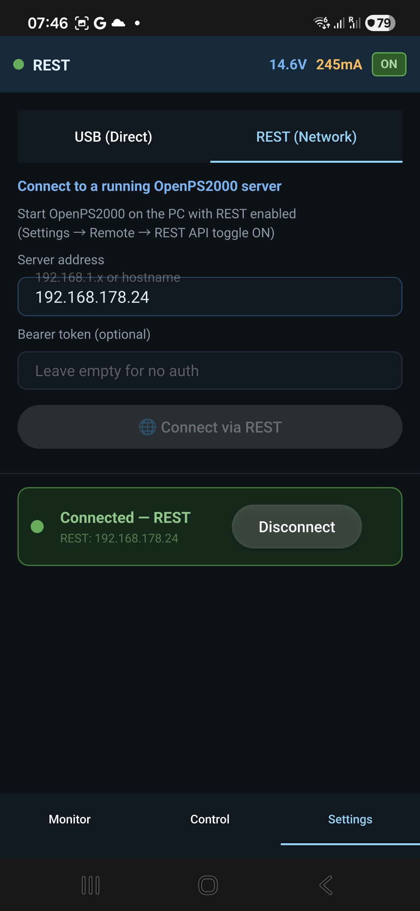

# ⚡ OpenPS2000

Open-source **Qt 6 / QML / C++** application for controlling
**EA Elektro-Automatik PS 2000 B** laboratory power supplies, available as:

- **Desktop app** (Linux / Windows / macOS) — direct USB connection
- **Android companion app** — USB OTG direct or remote control via REST API

**Author:** Libor Tomsik, OK1CHP  
**License:** [GNU GPL v3](LICENSE)

[](https://github.com/yeckel/OpenPS2000/actions/workflows/build.yml)

---

## Desktop

| Monitor | Battery Charger |
|---------|----------------|
|  |  |

| Pulse Generator | Sequence Editor |
|----------------|----------------|
|  |  |

## Android Companion App

| Monitor & Chart | Control | Settings |
|----------------|---------|----------|
|  |  |  |

---

## Features

### Live Monitor Tab
- **Real-time measurements** — voltage, current, power at 4 Hz over USB
- **Live charts** — dual-axis V/I chart with smooth scrolling
- **Zoom & pan** — scroll wheel (desktop) or `−`/`+` buttons (Android) to zoom;
  right-click drag (desktop) or `◀`/`▶` buttons (Android) to pan;
  `▶ Live` button re-engages live follow mode
- **Range statistics** — drag to select a time window; panel shows min/mean/max V/I/P,
  energy in Wh and charge in mAh for the selected interval
- **Energy counter** — cumulative energy integration with per-session reset
- **CSV & Excel export** — one-click export of the full session log

### Full Device Control
- Set **voltage** and **current** setpoints with mouse-wheel-enabled spinboxes (desktop)
  or touch sliders (Android)
- Set **OVP** (over-voltage) and **OCP** (over-current) protection limits
- **Output ON/OFF** toggle with keyboard shortcut
- **Remote / Manual** mode switch
- **Emergency stop** — large red button + `Space` key instantly cuts the output
- **Protection alarm** — OVP / OCP / OPP / OTP alarms detected and shown with
  **Ack & Resume** (restores output) or **Acknowledge** (output stays off)

### Battery Charger Tab *(experimental)*
- **5 chemistries:** LiPo, LiFe, Pb, NiCd, NiMH
- **CC/CV** algorithm for Li-ion and lead-acid; **CC + −ΔV termination** for NiCd/NiMH
- **Float stage** for lead-acid batteries
- **Profile manager** — create, edit, delete named profiles; 8 built-in defaults
- **Live charging chart** — dual-axis voltage/current curve with phase markers
- **Session statistics** — capacity (mAh), energy (Wh), duration, min/max V/I
- **Safety limits** — maximum voltage, current, time enforced by the state machine

### Pulse / Cycle Generator Tab
Software-timed square-wave generator. ON phase uses the main-panel setpoint; OFF phase
can either hold a lower setpoint or fully disable the output.

| Parameter | Limit | Reason |
|-----------|-------|--------|
| Minimum ON or OFF time | **500 ms** | One command per transition; coalescing queue prevents pile-up |
| Maximum practical frequency | **≈ 1 Hz** (500 ms + 500 ms) | Output-only mode (disable during OFF) |
| Emergency stop latency | **≤ 250 ms** | Output-OFF is always prioritised; flushes any queued commands |

> **Note:** The PSU processes one USB command per ~250 ms. Commands are coalesced
> (a newer setpoint for the same object replaces any queued older one) so the queue
> never grows unbounded. Emergency stop (`Space`) always bypasses the queue.

### Sequence / Sweep Tab
Program a multi-step voltage/current profile and execute it on the PSU.

- **Step editor** — add, remove, reorder steps; each step has voltage, current,
  hold time, and an optional ramp (linear interpolation from the previous step)
- **Popup table editor** — edit the full sequence in a resizable dialog with
  tooltips on every column explaining each parameter
- **Import / Export** — CSV, XLSX (Excel), and ODS (LibreOffice Calc) supported;
  files saved by third-party apps are fully compatible
- **Named profiles** — save and reload multiple sequences by name;
  importing a file replaces any existing profile with the same name
- **Live execution** — real-time progress display; stops automatically on disconnect

### Remote Control
OpenPS2000 can act as a **server** (PSU connected locally) or as a **remote client**
(controlling a server instance over the network). A second app instance on the same
machine is detected automatically.

#### REST API Server
Enable in **Settings → Remote → REST API**. Default port: **8484**.

| Method | Endpoint | Description |
|--------|----------|-------------|
| `GET`  | `/api/v1/info` | Device name, serial, firmware, nominal V/I/P |
| `GET`  | `/api/v1/status` | All measurements, setpoints, output state, alarms |
| `GET`  | `/api/v1/history?minutes=5` | Measurement statistics for the last N minutes |
| `GET`  | `/api/v1/limits` | OVP / OCP protection limits |
| `PUT`  | `/api/v1/setpoint` | `{"voltage":12.0,"current":2.0}` |
| `PUT`  | `/api/v1/output` | `{"enabled":true}` |
| `PUT`  | `/api/v1/limits` | `{"ovp":15.0,"ocp":5.0}` |
| `POST` | `/api/v1/alarm/acknowledge` | Acknowledge active protection alarm |

Optional Bearer token authentication — set in Settings, pass as
`Authorization: Bearer <token>` header. All numeric inputs are clamped to the
device's nominal ratings before forwarding to hardware.

#### MQTT Client *(requires Qt6::Mqtt)*
Enable in **Settings → Remote → MQTT**. Requires an external broker (e.g. Mosquitto).

| Direction | Topic | Payload |
|-----------|-------|---------|
| Publish | `{prefix}/measurement` | `{"v":12.3,"i":0.5,"p":6.15,"t":42.0}` |
| Publish | `{prefix}/status` | `{"output":true,"setV":12.0,"setI":2.0}` |
| Subscribe | `{prefix}/cmd/setpoint` | `{"voltage":12.0,"current":2.0}` |
| Subscribe | `{prefix}/cmd/output` | `{"enabled":true}` |
| Subscribe | `{prefix}/cmd/limits` | `{"ovp":15.0,"ocp":5.0}` |

#### Remote Client Mode
Connect to a server instance (GUI is fully functional — all tabs work remotely,
including Pulse/Cycle and Sequence):

```bash
# Explicit server URL (port 8484 added automatically if omitted)
./openps2000app --remote 192.168.1.10

# Auto-detected: if port 8484 responds on localhost, runs as client automatically
./openps2000app
```

#### System Tray
When **Minimize to tray** is enabled in Settings, closing the main window hides
the app to the system tray. Right-click the tray icon to show/quit.

### User Interface
- **Dark Material theme** throughout
- **Keyboard shortcuts** (desktop):

  | Action | Shortcut |
  |--------|----------|
  | Emergency stop | `Space` |
  | Power on (with confirmation) | `Space` (when off) |
  | Voltage up / down | `Ctrl+Up` / `Ctrl+Down` |
  | Current up / down | `Ctrl+Shift+Up` / `Ctrl+Shift+Down` |

- **Internationalization** — UI translated into 🇩🇪 German, 🇪🇸 Spanish, 🇨🇿 Czech,
  🇵🇱 Polish, 🇨🇳 Chinese (Simplified). Language persisted across restarts.
- **Port memory** — last used serial port saved and restored on startup
- **Disconnect detection** — USB cable removal detected within ~1 s; all running
  operations (charger, pulser, sequencer) stop automatically

---

## Downloads

Pre-built binaries are attached to each
[GitHub Release](https://github.com/yeckel/OpenPS2000/releases).

### Desktop app (USB direct)

| Platform | File |
|----------|------|
| Linux    | `OpenPS2000-linux-x86_64.AppImage` — `chmod +x`, then run |
| Windows  | `OpenPS2000-windows-x86_64.zip` — unzip, run `openps2000app.exe` |
| macOS    | `OpenPS2000-macos.zip` — unzip, double-click the `.app` bundle |

> **Linux:** add yourself to the `dialout` group and re-login so the app can
> access `/dev/ttyACM0`:
> ```bash
> sudo usermod -aG dialout $USER
> ```

### Android companion app (REST or USB OTG)

| File | Minimum Android |
|------|-----------------|
| `OpenPS2000-android-arm64.apk` | Android 9 (API 28), arm64 |

**Install (sideload):**
1. Enable **Settings → Security → Install unknown apps** for your browser or file manager
2. Download the APK and open it — Android will prompt to install

**Connection options:**

| Mode | How to use |
|------|-----------|
| **USB OTG (direct)** | Connect the EA-PS to your phone with a USB-A ↔ USB-C OTG adapter. In the app go to **Settings → USB (Direct)** → Scan → Connect. Grant USB permission when prompted. |
| **REST (network)** | Start the desktop app on the PC with REST enabled (**Settings → Remote → REST API**). In the Android app enter the PC's IP address under **Settings → REST (Network)** and tap **Connect via REST**. |

---

## Supported Hardware

| Property | Value |
|----------|-------|
| Series   | EA Elektro-Automatik PS 2000 B |
| Tested   | EA-PS 2084-05 B (84 V / 5 A / 160 W) |
| Interface | USB → virtual COM port (VCP) — CDC-ACM class |
| Baud rate | 115 200 bps, odd parity, 8 data bits, 1 stop bit |
| Linux port | `/dev/ttyACM0` |
| Windows port | `COMx` (check Device Manager) |
| macOS port | `/dev/tty.usbmodem*` |
| Android USB VID/PID | `0x232E` / `0x0010` |

> **Linux:** add your user to the `dialout` group, then re-login:
> ```bash
> sudo usermod -aG dialout $USER
> ```

---

## Protocol

Binary telegram protocol over the USB VCP as documented in `doc/`:

| Document | Contents |
|----------|----------|
| `ps2000b_programming.pdf` | Telegram framing, value scaling, workflow |
| `object_list_ps2000b_de_en.pdf` | Full object register list |

**Telegram format:** `SD DN OBJ [DATA…] CS_HI CS_LO`

Values are encoded as a fraction of the nominal rating:
`raw = 25600 × value / nominal`

---

## Building from Source

### Requirements

| Dependency | Version |
|------------|---------|
| Qt         | 6.7 or newer (Core, Gui, Quick, QuickControls2, SerialPort) |
| CMake      | 3.28+ |
| Compiler   | C++20 (GCC 12+, Clang 15+, MSVC 2022) |
| zlib       | system zlib (for XLSX/ODS import) |

On Debian/Ubuntu: `sudo apt install zlib1g-dev`

### Desktop (Linux / Windows / macOS)

```bash
git clone https://github.com/yeckel/OpenPS2000.git
cd OpenPS2000
cmake -B build -DCMAKE_BUILD_TYPE=Release app
cmake --build build --parallel
./build/bin/openps2000app
```

If Qt is installed in a non-standard location (e.g. `/opt/Qt`):

```bash
cmake -B build -DCMAKE_BUILD_TYPE=Release \
      -DCMAKE_PREFIX_PATH=/opt/Qt/6.9.2/gcc_64 app
```

### Android

Requires Qt 6.7+ for Android (arm64-v8a) and Android NDK 26+.
See `.github/workflows/build.yml` for the exact CI build commands.

---

## Quick Start

1. Connect the PS 2000 B via USB
2. Launch **OpenPS2000**
3. Select the serial port (auto-detected if only one VCP is present)
4. Click **▶ Connect** — model name, nominal voltage/current are read back
5. Enable **Remote** mode
6. Set voltage and current (spinboxes or `Ctrl+↑/↓`)
7. Press `Space` or click **Output ON**

---

## Architecture

See [doc/architecture.md](doc/architecture.md) for UML component, class, sequence, and state machine diagrams.

---

## Project Structure

```
OpenPS2000/
├── doc/                          EA protocol documentation (PDFs)
├── screenshots/                  Application screenshots
├── app/
│   ├── CMakeLists.txt
│   ├── main.cpp                  App entry point, engine/backend setup, i18n, wiring
│   ├── PS2000Protocol.h/cpp      Binary telegram encoder/decoder
│   ├── SerialTransport.h/cpp     QThread serial worker (4 Hz polling, disconnect detection)
│   ├── DeviceBackend.h/cpp       QML-exposed device control + alarm detection (local)
│   ├── RemoteBackend.h/cpp       DeviceBackend-compatible REST polling client (remote mode)
│   ├── RemoteServer.h/cpp        QTcpServer-based HTTP/1.1 REST API server
│   ├── MqttClient.h/cpp          Qt6::Mqtt client wrapper (optional, #ifdef HAVE_QT_MQTT)
│   ├── TrayManager.h/cpp         System tray icon + minimize-to-tray
│   ├── DataRecord.h              Measurement sample struct
│   ├── BatteryProfile.h/cpp      Charging profile definitions + JSON storage
│   ├── ChargerEngine.h/cpp       CC/CV/Float/−ΔV charging state machine
│   ├── PulseEngine.h/cpp         Software-timed pulse/cycle generator state machine
│   ├── SequenceProfile.h/cpp     Sequence profile storage + CSV/XLSX/ODS import/export
│   ├── SequenceEngine.h/cpp      Step-by-step voltage/current sequence executor
│   ├── XlsxWriter.h/cpp          OOXML .xlsx writer (zero external dependencies)
│   ├── OdsWriter.h/cpp           ODF Spreadsheet .ods writer
│   ├── ZipWriter.h/cpp           STORE-only ZIP (used by XlsxWriter + OdsWriter)
│   ├── ZipReader.h/cpp           ZIP reader (stored + deflate; reads LibreOffice/Excel files)
│   └── qml/
│       ├── Main.qml              Main window, toolbar, controls, alarm popup, status bar
│       ├── LiveChart.qml         Canvas scrolling dual-axis chart (shared desktop+Android)
│       ├── ChargerTab.qml        Battery charger UI tab
│       ├── ChargingChart.qml     Charging curve canvas chart
│       ├── PulseTab.qml          Pulse/cycle generator UI tab
│       ├── PulseChart.qml        Pulse waveform canvas chart
│       ├── SequenceTab.qml       Sequence management panel
│       ├── SequenceChart.qml     Sequence execution chart
│       ├── SequenceEditorDialog.qml  Popup table editor with import/export
│       └── RemoteSettingsPanel.qml   REST + MQTT configuration panel
├── android/
│   ├── CMakeLists.txt
│   ├── main.cpp                  Android entry point; NullBackend, BackendFactory
│   ├── AndroidSerialTransport.cpp  USB OTG CDC-ACM transport (JNI → UsbSerial.java)
│   ├── RemoteBackend.h/cpp       REST polling client (shared with desktop)
│   ├── java/org/openps2000/
│   │   ├── UsbSerial.java        Android USB Host CDC-ACM driver
│   │   └── AlarmNotification.java  Android system notification helper
│   └── qml/
│       ├── Main.qml              Android main window, top bar, tab bar
│       ├── MonitorTab.qml        Live V/I/P readings, scrolling chart, zoom controls
│       ├── ControlTab.qml        Output toggle, setpoint sliders, protection limits
│       └── SettingsTab.qml       USB / REST connection settings
└── .github/workflows/
    └── build.yml                 CI: Linux AppImage · Windows zip · macOS dmg · Android APK
```

---

## Battery Charger Safety

> ⚠️ **The battery charging feature is experimental.**
>
> Always supervise charging sessions. Never leave batteries unattended.
> Use proper fusing and fire-resistant containers.
> The author accepts **no liability** for damage caused by use of this software.

---

## Contributing

Pull requests are welcome. Please open an issue first to discuss what you would
like to change.

---

## License

[GNU General Public License v3.0](LICENSE)

Copyright © 2026 Libor Tomsik, OK1CHP
