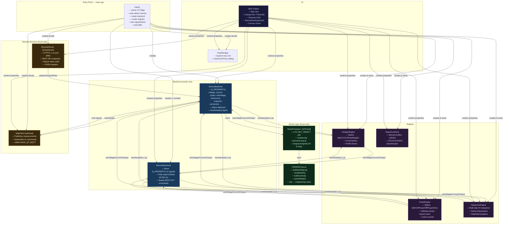
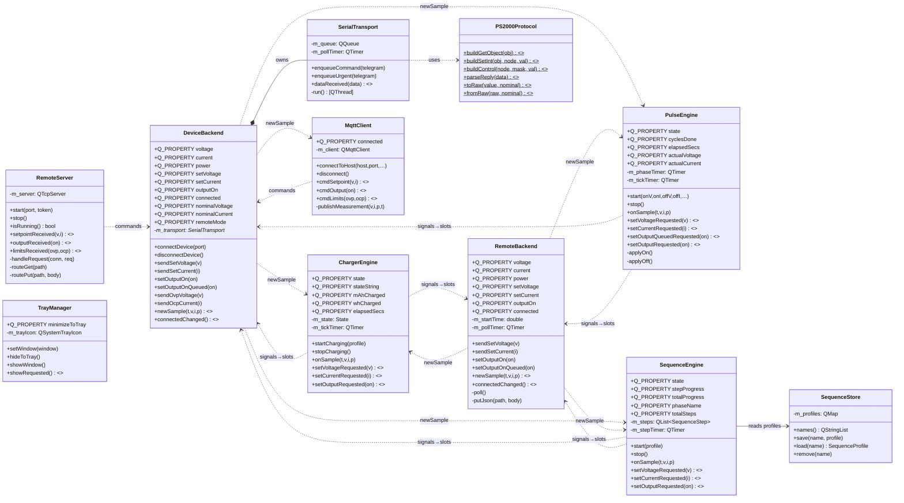
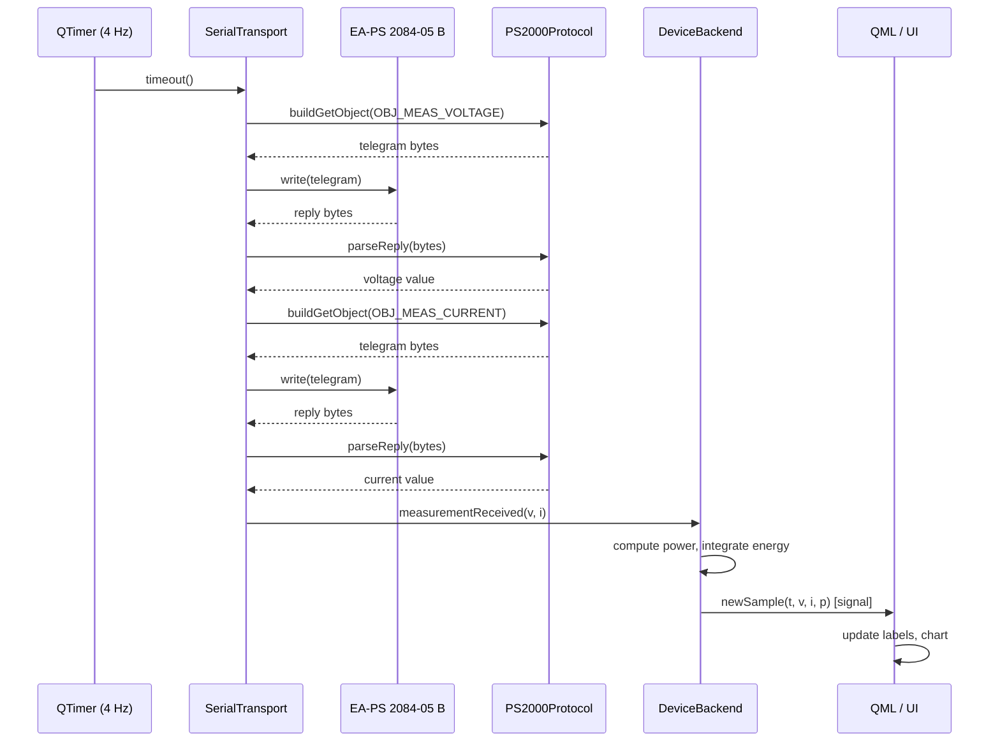
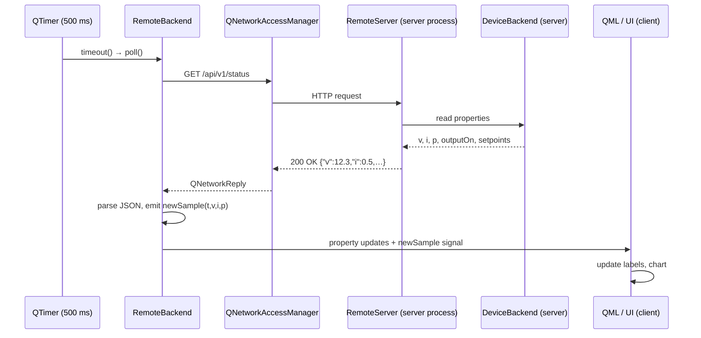
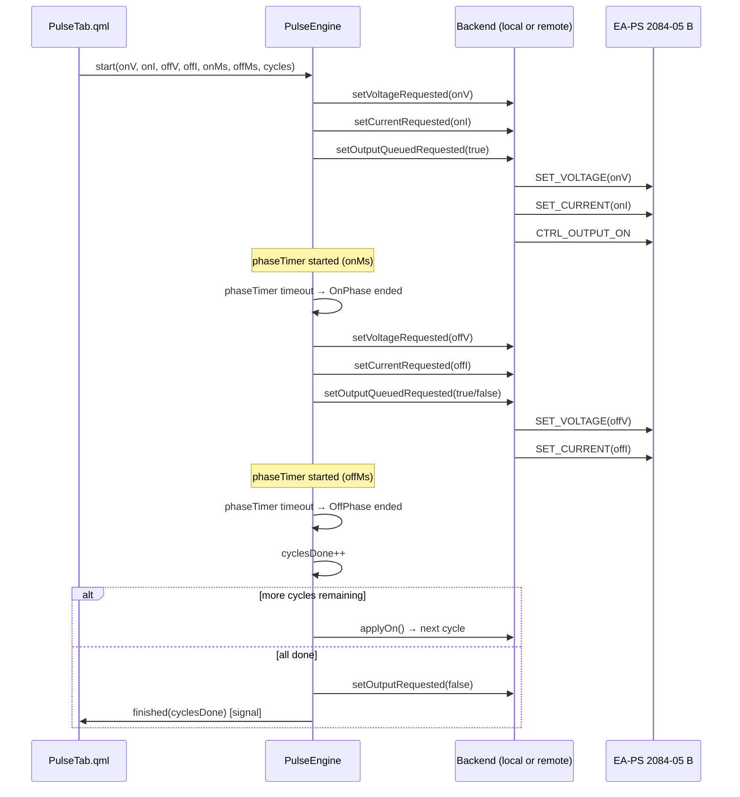
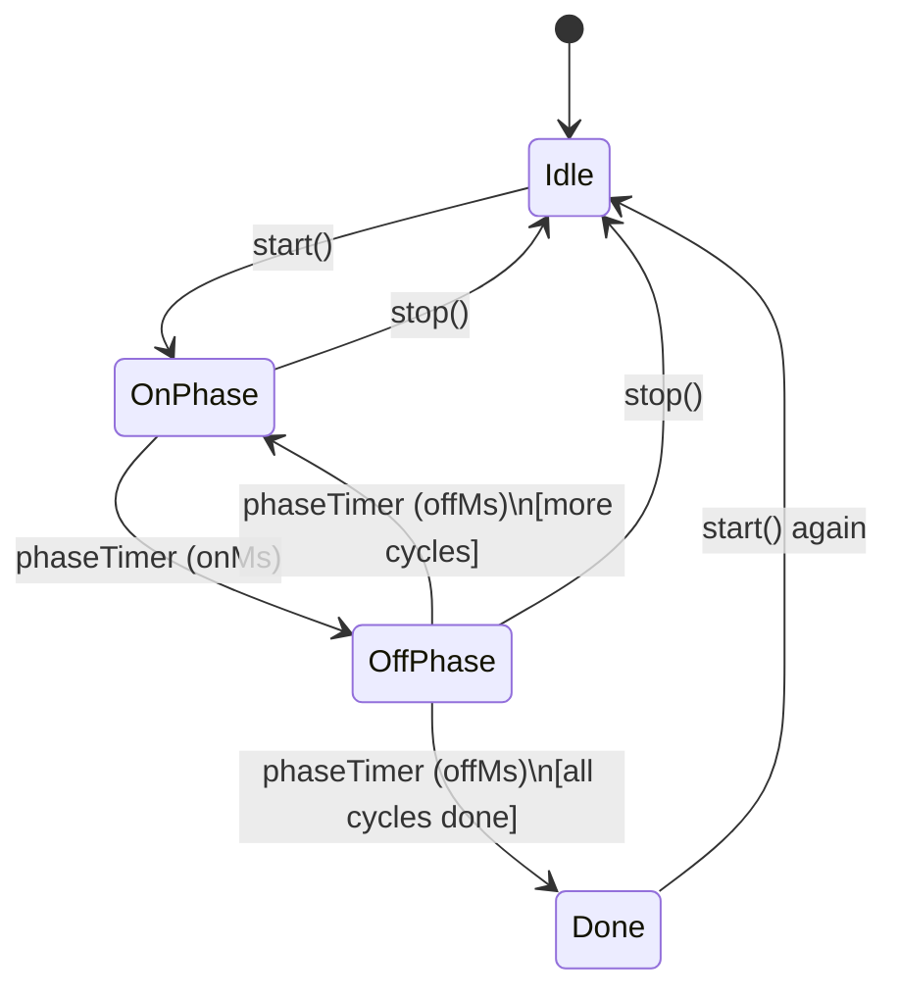
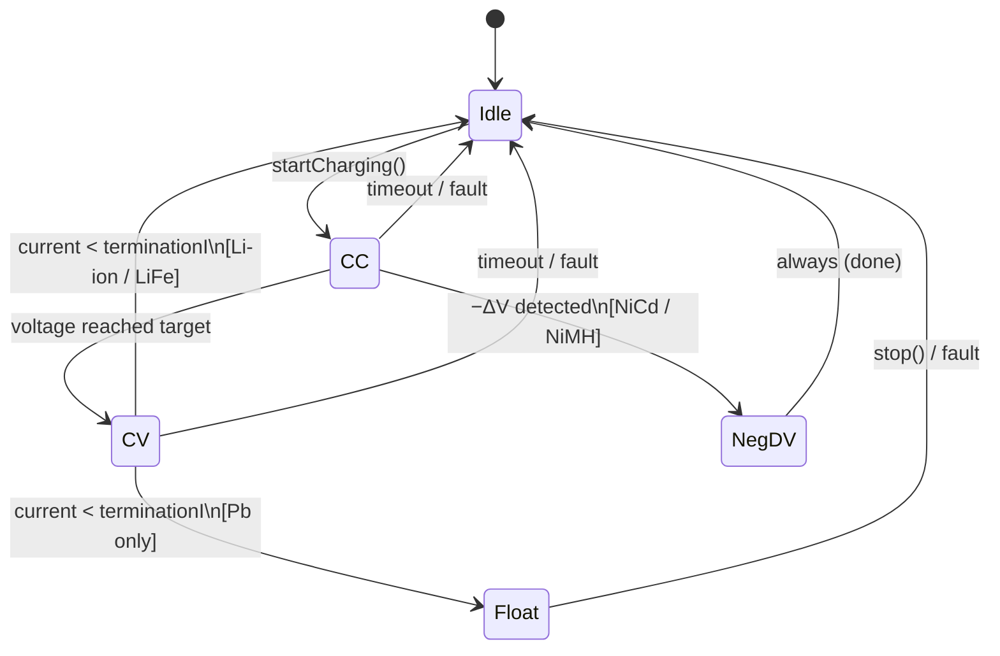

# OpenPS2000 — Architecture

This document describes the software architecture of OpenPS2000 using UML diagrams.

---

## 1. High-Level Component Diagram

Shows how the main subsystems relate at startup (one backend is created, engines
are wired to it, QML accesses everything via context properties).

---

## 2. Class Diagram

Key classes with their most important members and relationships.

---

## 3. Sequence Diagram — Local Mode Measurement Cycle

How a single measurement round-trip works at 4 Hz.

---

## 4. Sequence Diagram — Remote Mode Poll Cycle

How the remote client keeps its UI in sync with the server.

---

## 5. Sequence Diagram — Pulse Cycle (one ON/OFF period)

How `PulseEngine` drives the PSU through one pulse period.

---

## 6. State Machines

### PulseEngine states

### ChargerEngine states

